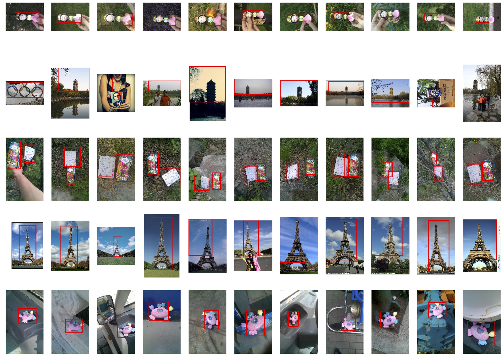

# Deep-Feature-based-Instance-Search

Contact: [Jimmy.Wu@my.cityu.edu.hk](mailto:Jimmy.Wu@my.cityu.edu.hk). Any questions or discussion are welcome! 

## Introduction
This project presents the two instance search methods with pre-trained deep features extracted from deep neural networks, e.g., ResNet-18 and VGG-11.

## Features
For the methodology-1, we use the deep features extracted from the global averaging pooling layer of ResNet-18 for instance search. The obtained feature vectors are 512-D, which is not very high-dimensional and is suitable for retrieval. For the methodology-2, we employ VGGNet (i.e., VGG-11) as our feature extractor. Note that VGGNet contains two modules: 1) feature module; 2) classification module. In this project, we use the feature module that consists multiple convolutional layers to extract features.

## Pipeline
We firstly use the selective search method to generate proposal for each retrieval image. Note that we keep 200 proposals for each image, resulting about 5698600 proposals in total. For the generated proposals, we then crop them with the size of 3 ∗ 224 ∗ 224, which meets the network input size of both ResNet-18 and VGG-11. In the next step, we extract the features of the generated proposals and query instances using ResNet-18 and VGG-11, respectively. Finally, for each query instance, we calculate its cosine similarities with all the other generated proposals in the feature space and rank the final retrieval images in an descending order based on the similarities.

## Dataset
We use the INSTRE dataset for this retrieval task. For dataset details can be found in https://github.com/insikk/instre_evaluation

## Installation
This code is tested on an Ubuntu 18.04 system with a RTX 2080TI GPU.

### Requirments
* Anaconda with Python 3.6.
* Nvidia GPU.
* PyTorch 0.4.1
* matplotlib
* OpenCV
* tqdm

### Step-by-step Installation

0. [Optional but highly recommended] Firstly create a new conda environment. 

    ~~~
    conda create --name instanceSearch python=3.6
    conda activate instanceSearch
    ~~~

1. Install pytorch/opencv/matplotlib.

    ~~~
    conda install pytorch=0.4.1 torchvision cuda92 -c pytorch
    pip install opencv-python
    pip install matplotlib
    pip install tqdm
    ~~~
## Retrieval Test

### Proposal generation and crop
Use the following code to generate proposals ans corp proposals

``` bash
python data_pre_processing.py
```

### Extract features for queries

``` bash
python handle_query.py
```

### Retrieval

``` bash
python retrieval.py
```

### Save ranklist and show qualitative results

``` bash
python show_result.py
```

## Qualitative results
We show the qualitative retrieval results using VGG-11 features here:

<div align="center">
  
  <p>Top-10 retrieval results of the VGG-11 feature based search method with respect to 5 query images (Q1 to Q5). The first column images indicates the query images and the other images are retrieval images which are listed in an descending order from left to right.</p>
</div>
